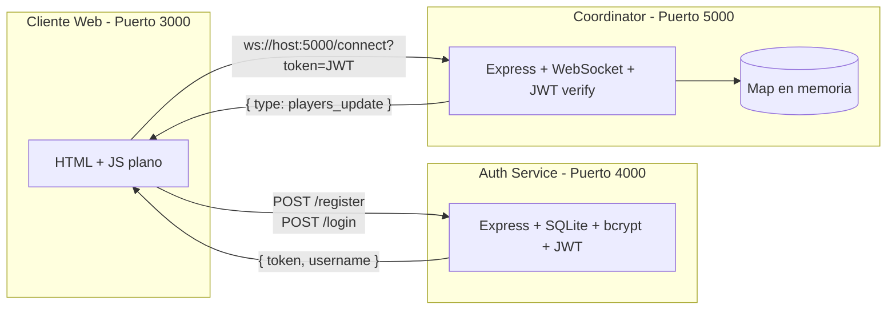
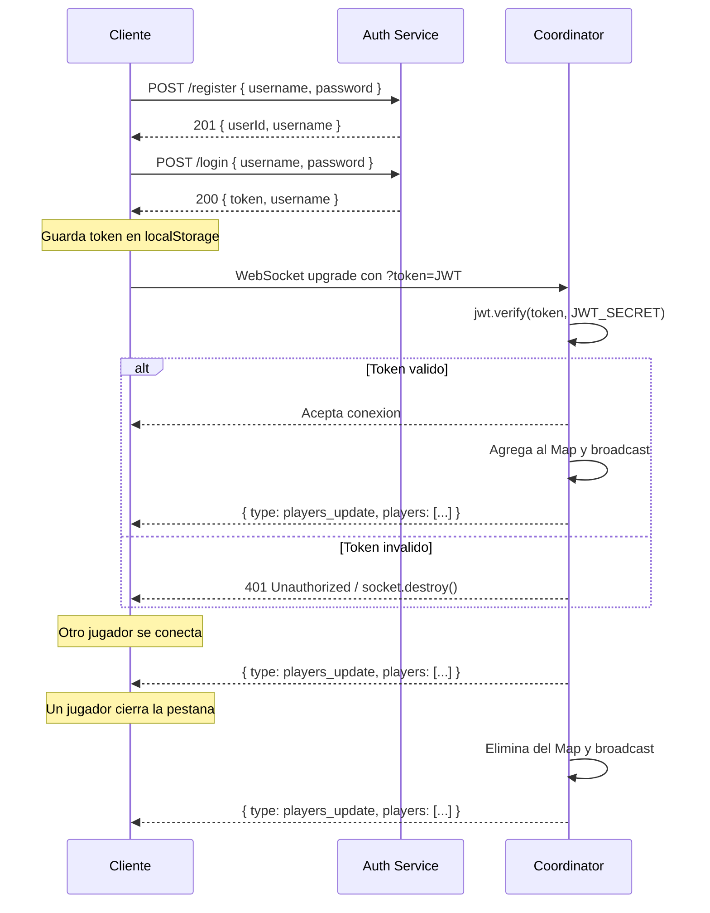
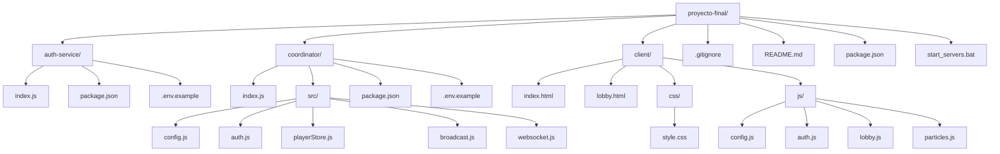
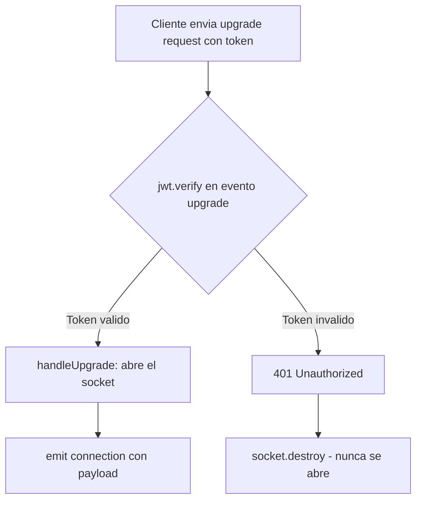

# Proyecto Final – Sistemas Distribuidos (Parte I: Identidad)

Sistema distribuido para un videojuego web multijugador donde varios jugadores se conectan desde sus navegadores y todos ven en tiempo real quién está en línea. Esta primera entrega cubre la pieza de **identidad**: registro, autenticación JWT y canal WebSocket autenticado.

---

## Arquitectura del Sistema



### Flujo de Comunicacion



---

## Equipo

| Integrante | Rol | Componente |
|---|---|---|
| Santiago | Backend Auth | `auth-service/` |
| Julian | Backend Coordinator | `coordinator/` |
| Karina | Frontend | `client/` |
| Karen | DevOps / Documentacion | README, integracion, despliegue |

---

## Estructura del Repositorio



---

## Instrucciones para Correr el Proyecto

### Prerrequisitos

- **Node.js** v18 o superior
- **npm** v9 o superior
- **ngrok** (para la sustentacion)

### Paso 1: Clonar el Repositorio

```bash
git clone https://github.com/Julianpril/proyecto-final.git
cd proyecto-final
```

### Paso 2: Instalar Dependencias

```bash
# Instalar dependencias del script raiz (concurrently)
npm install

# Instalar dependencias de cada servicio
cd auth-service && npm install && cd ..
cd coordinator && npm install && cd ..
```

### Paso 3: Configurar Variables de Entorno

Crear un archivo `.env` en `auth-service/` y `coordinator/` con el **mismo** JWT_SECRET:

**auth-service/.env**
```env
PORT=4000
JWT_SECRET=mi_secreto_super_seguro
```

**coordinator/.env**
```env
PORT=5000
JWT_SECRET=mi_secreto_super_seguro
```

> **IMPORTANTE:** Si las claves JWT son diferentes entre servicios, el Coordinator rechazara todos los tokens emitidos por Auth (`invalid signature`).

### Paso 4: Iniciar los 3 Servicios

**Opcion A - Script automatico (Windows):**
```bash
.\start_servers.bat
```

**Opcion B - npm desde la raiz:**
```bash
npm start
```

**Opcion C - Manual (3 terminales):**
```bash
# Terminal 1: Auth Service
cd auth-service && node index.js

# Terminal 2: Coordinator
cd coordinator && node index.js

# Terminal 3: Cliente Web
npx -y serve client -p 3000
```

### Paso 5: Probar en el Navegador

1. Ir a `http://localhost:3000`
2. Registrar un usuario nuevo
3. Iniciar sesion con ese usuario
4. Entrar al lobby y ver la lista de jugadores en linea

---

## Pruebas con cURL

### Registrar un usuario

```bash
curl -X POST http://localhost:4000/register \
  -H "Content-Type: application/json" \
  -d "{\"username\":\"alice\",\"password\":\"secret123\"}"
```

**Respuesta exitosa (201):**
```json
{ "userId": 1, "username": "alice" }
```

**Si el usuario ya existe (409):**
```json
{ "error": "Usuario ya existe" }
```

### Iniciar sesion

```bash
curl -X POST http://localhost:4000/login \
  -H "Content-Type: application/json" \
  -d "{\"username\":\"alice\",\"password\":\"secret123\"}"
```

**Respuesta exitosa (200):**
```json
{ "token": "eyJhbGciOiJIUzI1NiIs...", "username": "alice" }
```

**Credenciales invalidas (401):**
```json
{ "error": "Credenciales invalidas" }
```

### Probar el WebSocket con wscat

```bash
npm install -g wscat
wscat -c "ws://localhost:5000/connect?token=PEGA_AQUI_EL_TOKEN"
```

Al conectar recibiras:
```json
{ "type": "players_update", "players": [{"userId": 1, "username": "alice"}] }
```

---

## Decisiones de Diseno

### 1. Validacion JWT en el Upgrade (no en Connection)

La verificacion del token se realiza **interceptando el evento `upgrade`** del servidor HTTP, antes de que el handshake WebSocket se complete:

```javascript
server.on('upgrade', (req, socket, head) => {
    // Verificar JWT AQUI, antes de aceptar la conexion
    const payload = jwt.verify(token, JWT_SECRET);
    wss.handleUpgrade(req, socket, head, (ws) => {
        wss.emit('connection', ws, payload);
    });
});
```

**Justificacion:** Si validamos dentro de `wss.on('connection')`, el socket ya esta abierto cuando rechazamos. Esto permite que un atacante envie datos antes de ser desconectado. Al validar en el upgrade, el socket **nunca se abre** si el token es invalido.



### 2. Conexiones Duplicadas: Desconectar la Anterior

Si un mismo usuario (mismo `userId`) abre una segunda pestana o navegador, **la conexion anterior se cierra automaticamente** con codigo `4001` y la nueva toma su lugar.

```javascript
if (players.has(userId)) {
    const prev = players.get(userId);
    prev.socket.close(4001, 'Nueva conexion desde otro cliente');
}
players.set(userId, { username, socket: ws, connectedAt: ... });
```

**Justificacion:**
- Representa la intencion actual del usuario (puede haber cerrado la pestana antigua sin desconectarse limpiamente).
- Evita inconsistencias donde un usuario aparece "duplicado" en la lista.
- Es el comportamiento estandar en aplicaciones de mensajeria y juegos (WhatsApp Web, Discord, etc.).

### 3. Estado en Memoria (Map)

Usamos un `Map<userId, { username, socket, connectedAt }>` en memoria, sin persistencia.

**Justificacion:** Para esta primera parte no necesitamos persistencia del estado de conexion. Si el coordinator se reinicia, todos los clientes se reconectan automaticamente. En futuras partes (replicacion), este estado se sincronizara entre multiples instancias.

### 4. Contrasenas con bcrypt (10 rounds)

Las contrasenas se hashean con `bcrypt` usando un factor de costo de 10 rounds antes de almacenarse en SQLite. La contrasena en texto plano nunca se guarda, nunca se incluye en respuestas HTTP, y nunca aparece en logs.

### 5. CORS Habilitado en Auth Service

El Auth Service usa `app.use(cors())` para permitir peticiones desde el origen del cliente (diferente puerto). Sin esto, el navegador bloquearia las peticiones de registro y login.

---

## Despliegue con ngrok

Para la sustentacion, abrir **tres tuneles** en terminales separadas:

```bash
# Terminal 1 - Auth Service
ngrok http 4000

# Terminal 2 - Coordinator
ngrok http 5000

# Terminal 3 - Cliente Web
ngrok http 3000
```

Luego actualizar `client/js/config.js` con las URLs de ngrok:

```javascript
window.APP_CONFIG = {
    AUTH_API_URL: 'https://abc123.ngrok-free.app',
    COORDINATOR_WS_URL: 'wss://def456.ngrok-free.app'
};
```

> **IMPORTANTE:** Usar `wss://` (no `ws://`) para el Coordinator cuando se usa ngrok, porque ngrok expone por HTTPS. Si se mezcla `ws://` con `https://`, el navegador bloqueara la conexion por contenido mixto.

---

## Codigos de Error WebSocket

| Codigo | Significado |
|---|---|
| `1000` | Cierre normal (logout del usuario) |
| `1006` | Cierre anormal (servidor caido, red perdida) |
| `4001` | Token invalido o conexion reemplazada por nueva pestana |

---

## Seguridad

- **JWT firmado con HS256** con clave compartida entre Auth y Coordinator.
- **bcrypt (10 rounds)** para hashear contrasenas.
- **Validacion en upgrade**, no despues del handshake.
- **Prevencion de XSS**: el cliente escapa HTML en los nombres de usuario con `escapeHtml()`.
- **Contrasena nunca expuesta**: no aparece en respuestas, logs ni en la base de datos (solo el hash).
