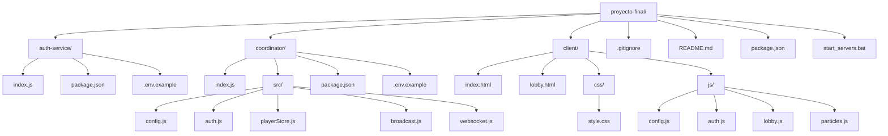
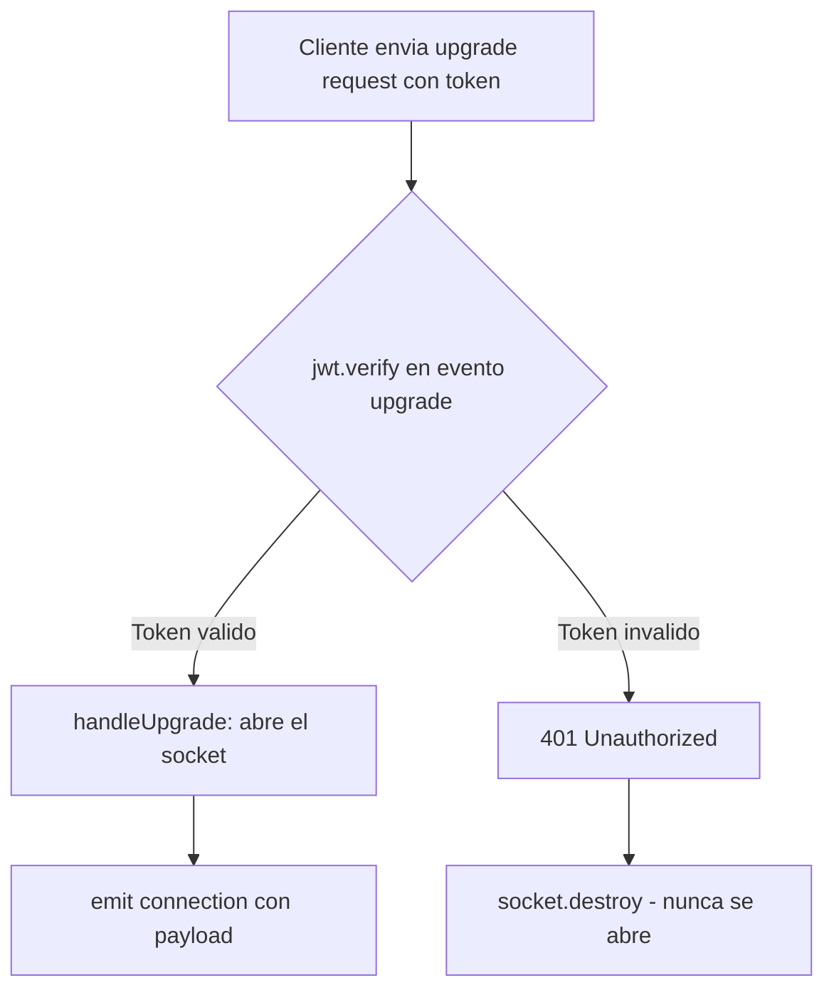

# Proyecto Final – Sistemas Distribuidos (Parte III: Mesh P2P y Tolerancia a Fallos)

Sistema distribuido para un videojuego web multijugador en tiempo real. Esta entrega final cubre la implementación de una **arquitectura Mesh P2P** con múltiples coordinadores, **client-side load balancing**, un directorio basado en **heartbeats** y tolerancia a fallos ante la desconexión de nodos.

---

## Arquitectura del Sistema

```mermaid
graph TD
    subgraph Cliente Web
        C[HTML5 Canvas + JS]
    end

    subgraph Auth Service (Directorio)
        A[Express + SQLite]
        D[Directorio de Nodos en Memoria]
    end

    subgraph Mesh de Coordinadores
        CO1[Coordinator A]
        CO2[Coordinator B]
        CO3[Coordinator C]
        CO1 <-->|WebSocket Peer| CO2
        CO2 <-->|WebSocket Peer| CO3
        CO1 <-->|WebSocket Peer| CO3
    end

    C -- "GET /coordinator (Load Balancing)" --> A
    A -- "Asigna nodo menos cargado" --> C
    C -- "Conexión Jugador" --> CO1
    CO1 -- "Heartbeat HTTP" --> A
    CO2 -- "Heartbeat HTTP" --> A
    CO3 -- "Heartbeat HTTP" --> A
```

### Flujo de Conexión

1. **Login:** El cliente se autentica localmente o por Google y obtiene un JWT.
2. **Descubrimiento:** El cliente hace un `GET /coordinator` al Auth Service para pedir la URL del coordinador con menos carga (Client-Side Load Balancing).
3. **Conexión:** El cliente abre un WebSocket seguro con el coordinador asignado.
4. **Replicación P2P:** Los movimientos, físicas de los orbes y eventos de red se replican a todos los nodos de la red Mesh enviando un campo `origin` para evitar tormentas de broadcast.

---

## Equipo

| Integrante | Rol | Componente |
|---|---|---|
| Santiago | Backend Auth | `auth-service/` |
| Julian | Backend Coordinator | `coordinator/` |
| Karina | Frontend | `client/` |
| Karen | DevOps / Documentacion | README, integracion, despliegue |

---

## Estructura del Repositorio


```mermaid
graph TD
    ROOT["proyecto-final/"] --> AUTH["auth-service/"]
    ROOT --> COORD["coordinator/"]
    ROOT --> CLIENT["client/"]
    ROOT --> GI[".gitignore"]
    ROOT --> README["README.md"]
    ROOT --> PKG["package.json"]
    ROOT --> BAT["start_servers.bat"]

    AUTH --> AI["index.js"]
    AUTH --> APK["package.json"]
    AUTH --> AEN[".env.example"]

    COORD --> CI["index.js"]
    COORD --> SRC["src/"]
    COORD --> CPK["package.json"]
    COORD --> CEN[".env.example"]

    SRC --> CFG["config.js"]
    SRC --> CAUTH["auth.js"]
    SRC --> PS["playerStore.js"]
    SRC --> BC["broadcast.js"]
    SRC --> WS["websocket.js"]

    CLIENT --> IDX["index.html"]
    CLIENT --> LOBBY["lobby.html"]
    CLIENT --> CSS["css/"]
    CLIENT --> JS["js/"]

    CSS --> STYLE["style.css"]
    JS --> JCFG["config.js"]
    JS --> JAUTH["auth.js"]
    JS --> JLOBBY["lobby.js"]
    JS --> JPART["particles.js"]
```

---

## Instrucciones para Correr el Proyecto

### Prerrequisitos

- **Node.js** v18 o superior
- **npm** v9 o superior
- **ngrok** (para la sustentacion)

### Paso 1: Clonar el Repositorio

```bash
git clone https://github.com/Julianpril/proyecto-final.git
cd proyecto-final
```

### Paso 2: Instalar Dependencias

```bash
# Instalar dependencias del script raiz (concurrently)
npm install

# Instalar dependencias de cada servicio
cd auth-service && npm install && cd ..
cd coordinator && npm install && cd ..
```

### Paso 3: Configurar Variables de Entorno

Crear un archivo `.env` en cada una de las carpetas de los servicios:

**auth-service/.env**
```env
PORT=4000
JWT_SECRET=mi_secreto_super_seguro
```

**coordinator/.env**
```env
PORT=5000
JWT_SECRET=mi_secreto_super_seguro
```

**client/.env**
```env
AUTH_API_URL=http://localhost:4000
COORDINATOR_WS_URL=ws://localhost:5000
```

> **IMPORTANTE:** Si las claves JWT son diferentes entre servicios, el Coordinator rechazara todos los tokens emitidos por Auth (`invalid signature`).

### Paso 4: Iniciar los 3 Servicios

Al iniciar el cliente, el sistema automaticamente generara el archivo `client/js/config.js` basado en los valores de `client/.env`.

**Opcion A - Script automatico (Windows):**
```bash
.\start_servers.bat
```

**Opcion B - npm desde la raiz:**
```bash
npm start
```

**Opcion C - Manual (3 terminales):**
```bash
# Terminal 1: Auth Service
cd auth-service && node index.js

# Terminal 2: Coordinator
cd coordinator && node index.js

# Terminal 3: Cliente Web
npx -y serve client -p 3000
```

### Paso 5: Probar en el Navegador

1. Ir a `http://localhost:3000`
2. Registrar un usuario nuevo
3. Iniciar sesion con ese usuario
4. Entrar al lobby y ver la lista de jugadores en linea

---

## Pruebas con cURL

### Registrar un usuario

```bash
curl -X POST http://localhost:4000/register \
  -H "Content-Type: application/json" \
  -d "{\"username\":\"alice\",\"password\":\"secret123\"}"
```

**Respuesta exitosa (201):**
```json
{ "userId": 1, "username": "alice" }
```

**Si el usuario ya existe (409):**
```json
{ "error": "Usuario ya existe" }
```

### Iniciar sesion

```bash
curl -X POST http://localhost:4000/login \
  -H "Content-Type: application/json" \
  -d "{\"username\":\"alice\",\"password\":\"secret123\"}"
```

**Respuesta exitosa (200):**
```json
{ "token": "eyJhbGciOiJIUzI1NiIs...", "username": "alice" }
```

**Credenciales invalidas (401):**
```json
{ "error": "Credenciales invalidas" }
```

### Probar el WebSocket con wscat

```bash
npm install -g wscat
wscat -c "ws://localhost:5000/connect?token=PEGA_AQUI_EL_TOKEN"
```

Al conectar recibiras:
```json
{ "type": "players_update", "players": [{"userId": 1, "username": "alice"}] }
```

---

## Decisiones de Diseno

### Fase de Operaciones y Features Extras

La guia completa para Google Cloud Console, el feature extra de color de jugador y la demo de autoridad antitrampas esta en [docs/fase-operaciones-extras.md](docs/fase-operaciones-extras.md).

### 1. Validacion JWT en el Upgrade (no en Connection)

La verificacion del token se realiza **interceptando el evento `upgrade`** del servidor HTTP, antes de que el handshake WebSocket se complete:

```javascript
server.on('upgrade', (req, socket, head) => {
    // Verificar JWT AQUI, antes de aceptar la conexion
    const payload = jwt.verify(token, JWT_SECRET);
    wss.handleUpgrade(req, socket, head, (ws) => {
        wss.emit('connection', ws, payload);
    });
});
```

**Justificacion:** Si validamos dentro de `wss.on('connection')`, el socket ya esta abierto cuando rechazamos. Esto permite que un atacante envie datos antes de ser desconectado. Al validar en el upgrade, el socket **nunca se abre** si el token es invalido.


```mermaid
graph TD
    A["Cliente envia upgrade request con token"] --> B{"jwt.verify en evento upgrade"}
    B -->|Token valido| C["handleUpgrade: abre el socket"]
    C --> D["emit connection con payload"]
    B -->|Token invalido| E["401 Unauthorized"]
    E --> F["socket.destroy - nunca se abre"]
```

### 2. Conexiones Duplicadas: Desconectar la Anterior

Si un mismo usuario (mismo `userId`) abre una segunda pestana o navegador, **la conexion anterior se cierra automaticamente** con codigo `4001` y la nueva toma su lugar.

```javascript
if (players.has(userId)) {
    const prev = players.get(userId);
    prev.socket.close(4001, 'Nueva conexion desde otro cliente');
}
players.set(userId, { username, socket: ws, connectedAt: ... });
```

**Justificacion:**
- Representa la intencion actual del usuario (puede haber cerrado la pestana antigua sin desconectarse limpiamente).
- Evita inconsistencias donde un usuario aparece "duplicado" en la lista.
- Es el comportamiento estandar en aplicaciones de mensajeria y juegos (WhatsApp Web, Discord, etc.).

### 3. Estado en Memoria (Map)

Usamos un `Map<userId, { username, socket, connectedAt }>` en memoria, sin persistencia.

**Justificacion:** Para esta primera parte no necesitamos persistencia del estado de conexion. Si el coordinator se reinicia, todos los clientes se reconectan automaticamente. En futuras partes (replicacion), este estado se sincronizara entre multiples instancias.

### 4. Contrasenas con bcrypt (10 rounds)

Las contrasenas se hashean con `bcrypt` usando un factor de costo de 10 rounds antes de almacenarse en SQLite. La contrasena en texto plano nunca se guarda, nunca se incluye en respuestas HTTP, y nunca aparece en logs.

### 5. CORS Habilitado en Auth Service

El Auth Service usa `app.use(cors())` para permitir peticiones desde el origen del cliente (diferente puerto). Sin esto, el navegador bloquearia las peticiones de registro y login.

---

## Decisiones de Diseño (Parte II)

### 6. Servidor Autoritativo

A diferencia de sistemas donde el cliente decide su posición, aquí el cliente solo envía **intenciones** (eje X e Y). El servidor valida estas intenciones y calcula la posición final en el `tick()`.

**Justificación:** Evita trampas de velocidad o teletransporte (Speedhacks/Teleport), ya que si un cliente intenta forzar una posición en su memoria local, el servidor lo ignorará y lo sobreescribirá en el siguiente broadcast de estado.

### 7. Normalización de Movimiento Diagonal

Se utiliza `Math.hypot(x, y)` para calcular la magnitud del vector de movimiento. Si la magnitud es mayor a 1, se divide el vector por su magnitud.

**Justificación:** Sin normalización, un jugador moviéndose en diagonal (ej. arriba y derecha) viajaría a ~1.41 veces la velocidad normal ($\sqrt{1^2 + 1^2}$). La normalización garantiza una velocidad uniforme de 200px/s en cualquier dirección.

### 8. Feature Extra: Color Replicado

Se implementó un sistema de `extras` persistente durante la sesión. El cliente puede enviar un mensaje `extras_update` con un color hexadecimal.

**Justificación:** Demuestra la capacidad del protocolo para manejar estados adicionales que no son físicos (como cosméticos o estados de animación) y replicarlos eficientemente a todos los clientes conectados.

### 9. Google Auth con ID Token Verification

Se implementó el flujo de **Google Identity Services** donde el cliente obtiene un `idToken` y el servidor lo valida usando la librería oficial `google-auth-library`.

**Justificación:** Delegar la autenticación a un proveedor confiable aumenta la seguridad. Validamos el `audience` y el `sub` (identificador único estable) para asegurar que el token fue emitido específicamente para nuestra aplicación.

---

---

## Decisiones de Diseño (Parte III)

### 10. Mesh P2P Descentralizado
Los coordinadores se descubren mediante el Auth Service (Directorio) y abren conexiones WebSocket persistentes entre ellos. Para evitar bucles infinitos en la red (Broadcast Storm), todos los paquetes viajan con un `origin`. Si un nodo recibe un paquete de sí mismo, lo descarta silenciosamente.

### 11. Orden Lexicográfico de Conexión
Para garantizar una sola conexión bidireccional entre cada par de coordinadores (y evitar conexiones duplicadas en cruz), se implementó un orden estricto de conexión. Solo el nodo con el ID "menor" alfabéticamente (ej: `coord-A` hacia `coord-B`) inicia la conexión. El nodo "mayor" recibe y acepta de forma pasiva.

### 12. Directorio mediante Heartbeats (Tolerancia a Fallos)
Cada coordinador emite un heartbeat HTTP cada 2 segundos al Auth Service reportando su estado, endpoints y carga actual. Si el Auth Service deja de recibir noticias de un nodo por más de 6 segundos, asume que ha muerto y lo elimina de la tabla de enrutamiento. Si un nodo cae, los clientes se reconectan automáticamente obteniendo instantáneamente un nodo sano (Alta Disponibilidad).

---

## Despliegue Distribuido con Ngrok (Sustentación)

El sistema está preparado nativamente para ejecutarse en múltiples computadoras a través de internet usando Ngrok y variables de entorno de Node.js.

### Topología de Nodos Recomendada

Para un grupo de trabajo de 6 personas:
1. **PC 1 (Auth Service):** Ejecuta `node index.js` en `auth-service` y levanta `ngrok http 4000`. Este será el directorio central y base de datos.
2. **PCs 2, 3 y 4 (Coordinadores del Mesh):** Corren su propio nodo en el puerto `5000`. Cada uno abre `ngrok http 5000`. 
   - Modifican su archivo `.env` configurando su URL local de Ngrok (usando `wss://`) en `PUBLIC_URL` y agregando `/peer` al final para `PEER_URL`. 
   - Cada PC se asigna un `COORDINATOR_ID` diferente (ej: `coord-A`, `coord-B`, `coord-C`).
3. **PC 5 (Servidor Web):** Corre el frontend en el puerto 3000 y levanta `ngrok http 3000`. Modifica su `.env` configurando `VITE_AUTH_SERVICE_URL` apuntando al Ngrok del PC 1.
4. **PC 6 (Jugadores):** Entran libremente a la URL pública de la página web desde Chrome y juegan.

*Nota Técnica:* Gracias a la unificación del Upgrade del WebSocket bajo Express, cada PC coordinador solo necesita **un (1) túnel gratuito de Ngrok** para compartir el mismo puerto lógico con la red de Mesh (interna) y los clientes públicos.

---

## Codigos de Error WebSocket

| Codigo | Significado |
|---|---|
| `1000` | Cierre normal (logout del usuario) |
| `1006` | Cierre anormal (servidor caido, red perdida) |
| `4001` | Token invalido o conexion reemplazada por nueva pestana |

---

## Seguridad

- **JWT firmado con HS256** con clave compartida entre Auth y Coordinator.
- **bcrypt (10 rounds)** para hashear contrasenas.
- **Validacion en upgrade**, no despues del handshake.
- **Prevencion de XSS**: el cliente escapa HTML en los nombres de usuario con `escapeHtml()`.
- **Contrasena nunca expuesta**: no aparece en respuestas, logs ni en la base de datos (solo el hash).
